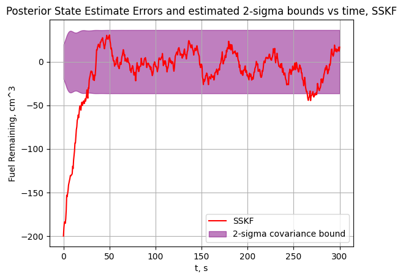

# Project 4: Kalman Filtering for Fuel Estimation

## Overview
Implements standard and steady-state Kalman filters for estimating fuel remaining and flowmeter bias in a simulated system. Uses a linear state-space model and compares filter performance. Also implements a fixed interval kalman smoother and examins the effect on state estimates.

## Results

*Estimated fuel vs time (SSKF): Kalman filter tracks true fuel closely and has an accurate covariance estimate.*

## More Results
The full set of plots is already available in the `plots/` folder. You can also navigate to this directory and run `P4.py` to regenerate them if desired.

## commentary
As can be seen by the plots produced, the kalman filtering framework provides multiple
ways to estimate states via sensor fusion. As implemented, the base kalman filter struggles to 
track the true fuel remaining and flowmeter bias. While it appears as though this is caused 
by too low a process noise matrix, leading to too much trust in the model 
(shown by small covariance and out of bounds errors), the SSKF child class
performs much better with all the same equations save for the kalman gain calculation, which is constant
and derived from the LQE DARE problem for the SSKF. This is further supported by the kalman gain plot, which 
shows that the KF does not converge to the SSKF gains. I've checked the standard kalman filter gain calculation,
tried different expressions, and re-coded the function but haven't found the culprit for this behavior yet. 
However, in a normal scenario the KF should converge to the SSKF and have the advantage of being able to 
calculate the kalman gain adaptively online, leading to a more flexible and adaptive, while very similar, 
 solution as compared to the KF. It can also be seen that the SSKF approximates the covariances 
 of the states well, with the 95% bounds on both fuel remaining and meter bias containing the errors about 
 95 percent of the time. 
 
 Moving on, the CI-KF can be seen to have worse performance, as it 
 struggles to fix steady state fuel remaining value with overly-small state covariances, then suddenly
 blows up in terms of covariance and erratically oscillates around the true states, seemingly 
 only chasing the measured values, discarding the prediction. This leads to very large errors, oscillations in 
 state, and covariances for most of the data window. So while the CI-KF may be useful in 
 sensor fusion of unknown correlation or in different contexts, it appears to be a poor choice for 
 fusing this data.
 
 Finally, the FIKS does the job of smoothing the states well, as can be seen by the much smoother output 
 as compared to the SSKF data it smooths. It also entirely fixes the initial convergence period 
 the SSKF has where it is initialized with a large error and small covariance, so takes a long time to converge
 to the true states. As shown in the fuel remaining plot, the FIKS tracks the true value from time zero with much
 less oscillations. However, it appears as though this is done at the cost of much increased smoothed covariance
 estimates. The FIKS has a variances of over 100 for most of the fuel remaining estimate, while the SSKF
 variances remain under 50 for the same data. So it appears that the FIKS, while doing a good job of 
 smoothing the data and keeping the error similar (for this dataset, at least), decreases the confidence in the 
 accuracy of that data as estimated by the filter. 