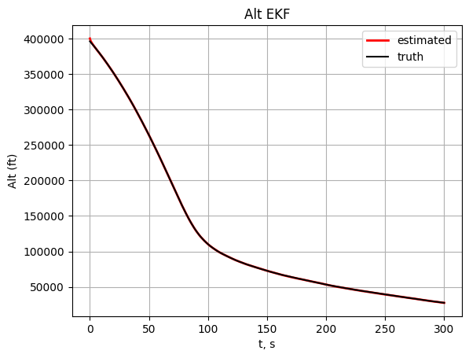
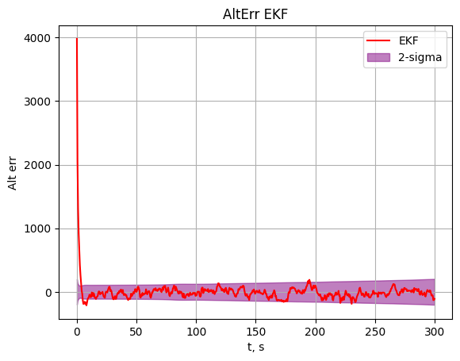

# Project 5: Nonlinear Kalman Filtering for Ballistic Altitude

## Overview
Implements Extended and Unscented Kalman Filters for state estimation of altitude and vertical speed, and parameter estimation of ballistic coefficient of a simulated ballistic vehicle. Uses nonlinear process and measurement models that simulate altitude-dependent atmospheric drag and range-dependent radar returns. 

## Results

*Altitude estimate (EKF): filter tracks true altitude throughout flight.*

*Altitude error (EKF): filter has low error and accurate covariance estimate throughout flight.*

## More Results
The full set of plots is already available in the `plots/` folder. You can also navigate to this directory and run `P5.py` to regenerate them if desired.
